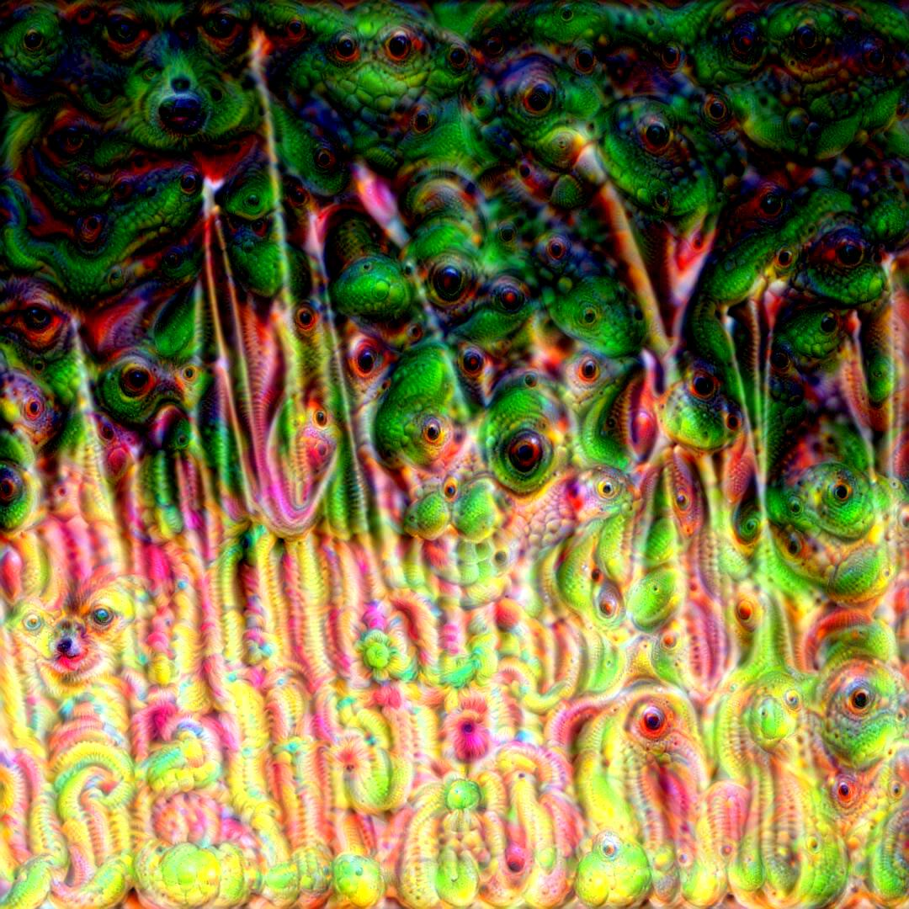
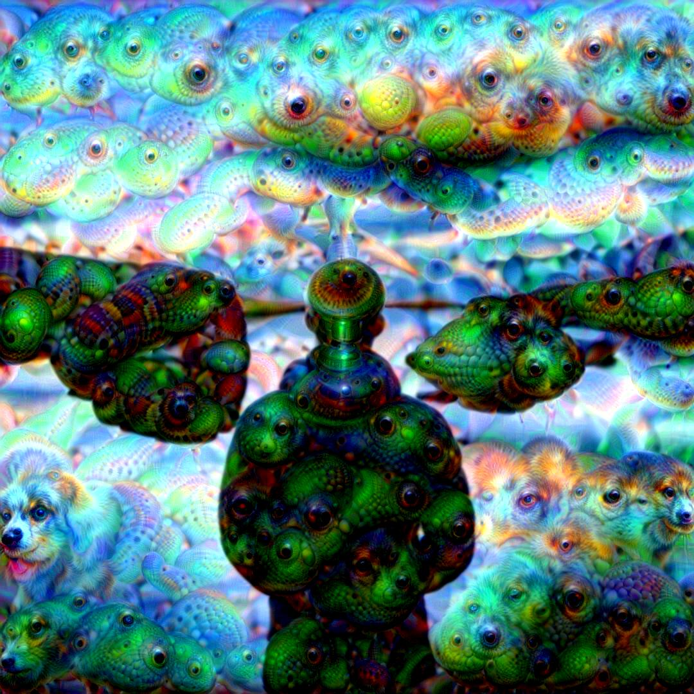
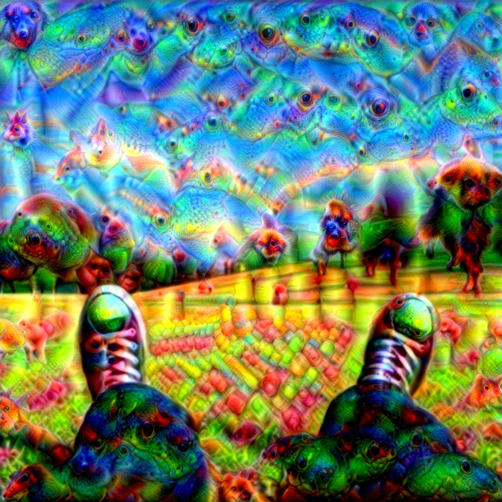
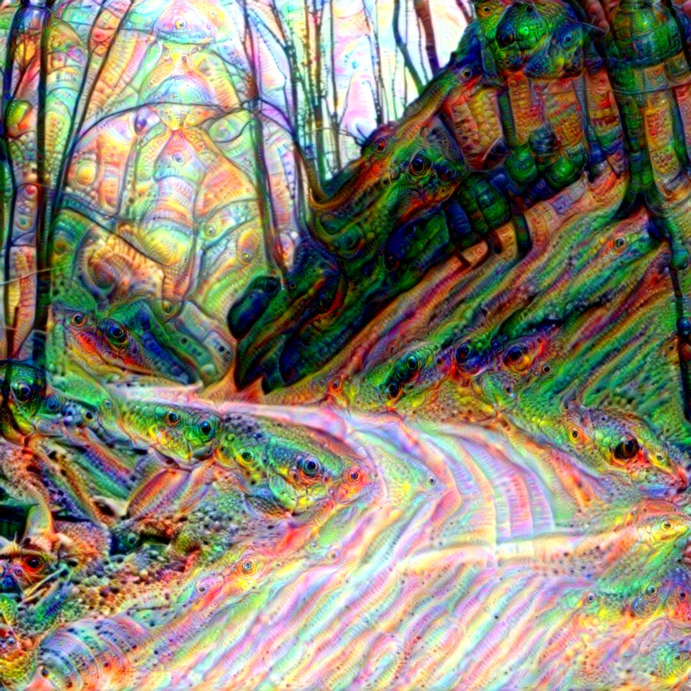

<h3 align="center">
  
</h3>

# Deep Dream

Minimal Python/TensorFlow implementation of the DeepDream algorithm originally created by [Alexander Mordvintsev](https://ai.googleblog.com/2015/06/inceptionism-going-deeper-into-neural.html).

<a href="https://www.instagram.com/__deep__dreams__/">Daily dose of deep dreams on instagram.</a>

## Usage

To use on the predefined .jpg image:
 
	python3 deep_dream.py <path_to_the_image>

or

	python3 deep_dream.py

to perform on the random image.

## How does it work?

We are using **Inception5h** model which was designed to classify images. 

During the classification process we are providing input images and using gradient descent to adapt weights to the images through filters. 

**DeepDream** algorithm does the opposite. It adapts the input images to match the network weights with **gradient ascent** which results in visualizing network filters on the input images giving them psychodelic look.

## Results

## Author

**Greg (Grzegorz) Surma**

[**PORTFOLIO**](https://gsurma.github.io)

[**GITHUB**](https://github.com/gsurma)

[**BLOG**](https://medium.com/@gsurma)
